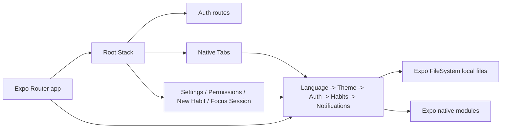

# Architecture

## Overview

DeGrow is a local-first Expo Router React Native application. It uses route files under `app/`, context providers under `providers/`, shared domain constants under `constants/`, and native guarded services under `services/`.

Evidence: `package.json:L2-L4`, `app/_layout.tsx:L55-L89`, `providers/habits-provider.tsx:L41-L58`, `services/local-notifications.ts:L90-L136`.

## Root Composition

The root layout nests providers in this order: language, theme, auth, habits, notifications, bottom sheet provider, and root navigation. This order matters because downstream screens use translations, theme values, auth state, habits state, and notification side effects.

Evidence: `app/_layout.tsx:L71-L89`.

The root stack registers auth, tabs, modal, new habit, settings, permissions, and habit session routes. Authenticated users are redirected away from auth routes; unauthenticated users are redirected to login except when already in the auth group.

Evidence: `app/_layout.tsx:L31-L41`, `app/_layout.tsx:L55-L67`.

## Navigation

The app uses Expo Router file-based routing. The tab layout uses `unstable-native-tabs`, configures a transparent/blurred tab bar, and declares two current tabs: `index` and `profile`.

Evidence: `app/(tabs)/_layout.tsx:L1-L7`, `app/(tabs)/_layout.tsx:L14-L82`.

Detail routes are pushed through `router.push`, for example home pushes `settings`, `new-habit`, and `habit-session`.

Evidence: `app/(tabs)/index.tsx:L216-L280`.

## State Management

State is held in React context providers and persisted locally:

- Auth user: `degrow-user.json`.
- Habits: `degrow-habits.json`.
- Language preference: `degrow-language.txt`.
- Theme preference: `degrow-theme.txt`.

Evidence: `providers/auth-provider.tsx:L23-L51`, `providers/habits-provider.tsx:L41-L58`, `providers/language-provider.tsx:L14-L16`, `providers/theme-provider.tsx:L66-L68`.

## Error Handling Strategy

The current strategy is defensive local handling:

- Auth and habits providers catch storage read/write errors and continue with safe defaults.
- Local notification service guards native module imports and warns when unavailable.
- Permissions screen catches native permission failures and falls back to unavailable statuses.

Evidence: `providers/auth-provider.tsx:L59-L104`, `providers/habits-provider.tsx:L73-L131`, `services/local-notifications.ts:L90-L136`, `app/permissions.tsx:L81-L160`.

## Performance Considerations

- Habit lists are small and rendered directly from provider state.
- Native notification scheduling cancels and reschedules reminders when habits or language change.
- UI uses static `StyleSheet` objects and theme values passed into style arrays.
- No virtualization is currently needed for the seeded five-habit list, but a future remote database could require FlatList for large collections.

Evidence: `constants/habits.ts:L109-L200`, `providers/notifications-provider.tsx:L69-L83`, `app/(tabs)/index.tsx:L221-L280`.

## Security Considerations

Auth is currently demo-only and local. It should not be treated as production authentication. User data and habits are stored in local files without encryption in this implementation.

Evidence: `providers/auth-provider.tsx:L23-L51`, `providers/auth-provider.tsx:L106-L120`, `providers/habits-provider.tsx:L41-L58`.

## Observability

There is no formal logging, metrics, tracing, or crash reporting integration in the current repo. The only notable runtime diagnostic path is a warning when local notifications are unavailable.

Evidence: `services/local-notifications.ts:L104-L114`. Search baseline found no logging/metrics SDK configuration.

## Known Limitations

- [TBD] Backend API, production auth, and database are not implemented. How to confirm: inspect future files outside `backend/templates/`.
- [TBD] Automated tests are not implemented. How to confirm: inspect future `package.json` scripts and test files.
- [TBD] Production release pipeline is not implemented. How to confirm: inspect future CI/EAS configuration.
