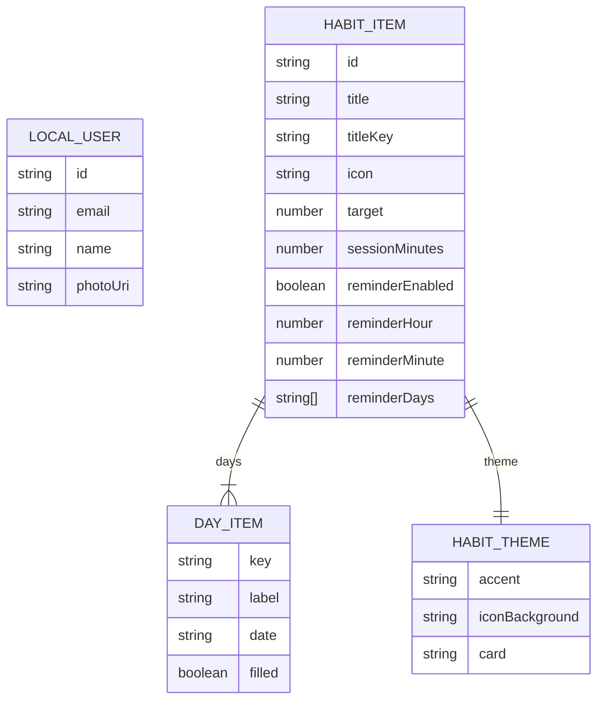

# Data Model

## Storage Overview

The current data model is local-first and file-based. It uses Expo FileSystem document files for user, habits, theme, and language preferences.

Evidence: `providers/auth-provider.tsx:L23-L51`, `providers/habits-provider.tsx:L41-L58`, `providers/theme-provider.tsx:L66-L68`, `providers/language-provider.tsx:L14-L16`.

## Local Files

| File | Purpose | Producer | Consumer |
| --- | --- | --- | --- |
| `degrow-user.json` | Demo user and profile data | `AuthProvider` | `AuthProvider`, profile screen, root auth gate |
| `degrow-habits.json` | Habit list and `weekId` | `HabitsProvider` | Home, new habit, focus session, notifications |
| `degrow-theme.txt` | Theme preference: `system`, `light`, or `dark` | `ThemeProvider` | All themed screens |
| `degrow-language.txt` | Language preference: `en` or `es` | `LanguageProvider` | All translated screens |

Evidence: `providers/auth-provider.tsx:L23-L51`, `providers/habits-provider.tsx:L41-L58`, `providers/theme-provider.tsx:L5-L6`, `providers/theme-provider.tsx:L66-L123`, `providers/language-provider.tsx:L4-L16`, `providers/language-provider.tsx:L565-L614`.

## HabitItem Shape

`HabitItem` includes id, title/titleKey, icon, theme, weekly days, target, session minutes, reminder enabled flag, reminder time, and reminder days.

Evidence: `constants/habits.ts:L21-L39`.

## Seed Data

The app seeds five habits: reading, gym, homemade food, sleep, and mindfulness. Each seed includes a theme, target, session length, and reminder defaults.

Evidence: `constants/habits.ts:L109-L200`.

## Migration Strategy

No explicit migration framework exists. `sanitizeHabit()` applies defaults when loading older or partial habit objects. A future backend/database integration should introduce versioned migrations before changing persisted shapes.

Evidence: `providers/habits-provider.tsx:L47-L58`, `providers/habits-provider.tsx:L73-L116`.

## Data Gaps

- [TBD] Remote database schema. How to confirm: inspect future backend/database files.
- [TBD] Long-term habit history and analytics model. How to confirm: inspect future changes to `HabitItem` and provider persistence.
- [TBD] Encrypted local persistence. How to confirm: inspect future storage implementation; current providers use FileSystem text files.
