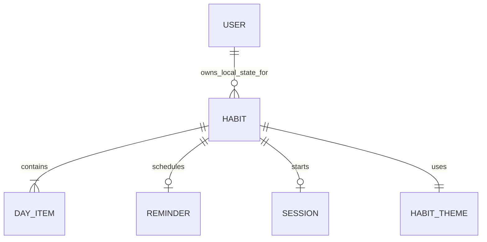

# Domain Model

## Core Concepts

- User: the locally authenticated person using DeGrow.
  Evidence: `providers/auth-provider.tsx:L5-L10`.
- Habit: a tracked behavior with a name, icon, color theme, weekly days, optional reminder, and optional timer length.
  Evidence: `constants/habits.ts:L21-L39`.
- Day item: one day in the current habit week with completion state and display labels.
  Evidence: `constants/habits.ts:L11-L16`, `constants/habits.ts:L57-L87`.
- Theme: a color bundle for habit cards and UI accents.
  Evidence: `constants/habits.ts:L18-L20`, `providers/theme-provider.tsx:L8-L55`.
- Reminder: optional local notification configuration with enabled state, hour, minute, and selected days.
  Evidence: `constants/habits.ts:L32-L37`, `services/local-notifications.ts:L230-L317`.
- Focus session: a timer session linked to a habit and session length in minutes.
  Evidence: `app/habit-session.tsx:L18-L49`, `app/new-habit.tsx:L652-L681`.

## Relationships

Evidence: `providers/habits-provider.tsx:L133-L208`, `constants/habits.ts:L21-L39`.

## Domain Rules

- Weeks start on Saturday for generated habit day labels.
  Evidence: `constants/habits.ts:L57-L87`.
- Habit state resets if stored data belongs to a previous computed week.
  Evidence: `providers/habits-provider.tsx:L61-L66`, `providers/habits-provider.tsx:L73-L116`.
- Completing today toggles the current day derived from JavaScript day index.
  Evidence: `constants/habits.ts:L43-L55`, `providers/habits-provider.tsx:L191-L208`.
- New habits default to all current week days generated by `buildWeekDays()`.
  Evidence: `providers/habits-provider.tsx:L133-L150`.
- Reminders are scheduled daily when every day is selected; otherwise they are scheduled weekly per selected day.
  Evidence: `services/local-notifications.ts:L266-L313`.

## Known Domain Gaps

- [TBD] Habit ownership across multiple users is not modeled for a backend database. How to confirm: inspect future database schema and auth integration.
- [TBD] Streak history beyond the current week is not persisted in the current `HabitItem` model. How to confirm: inspect future changes to `constants/habits.ts` and `providers/habits-provider.tsx`.
