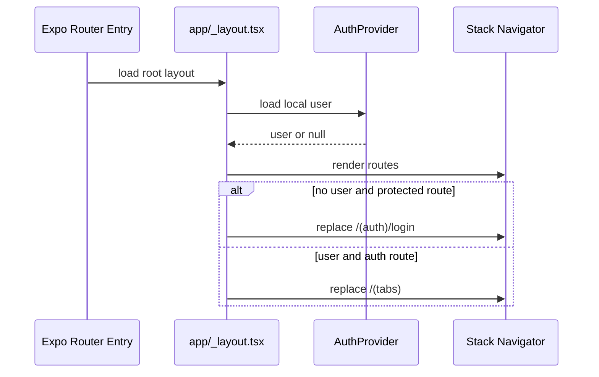
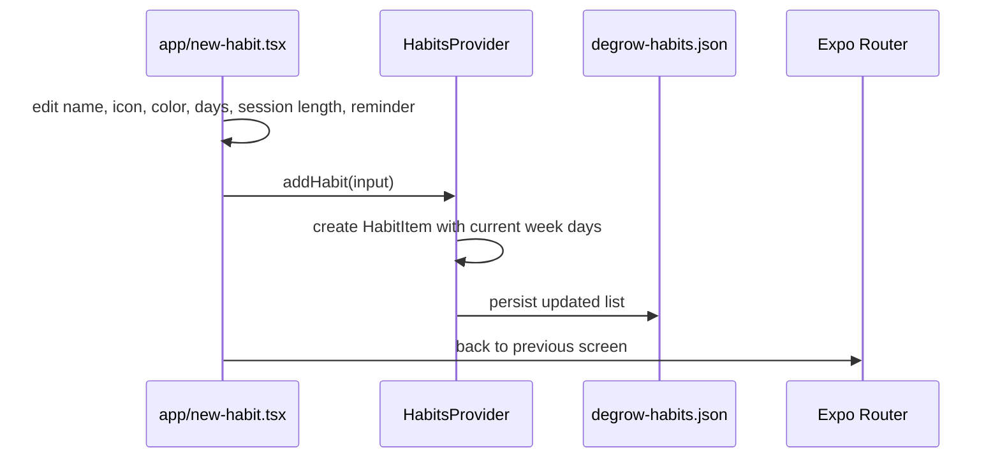
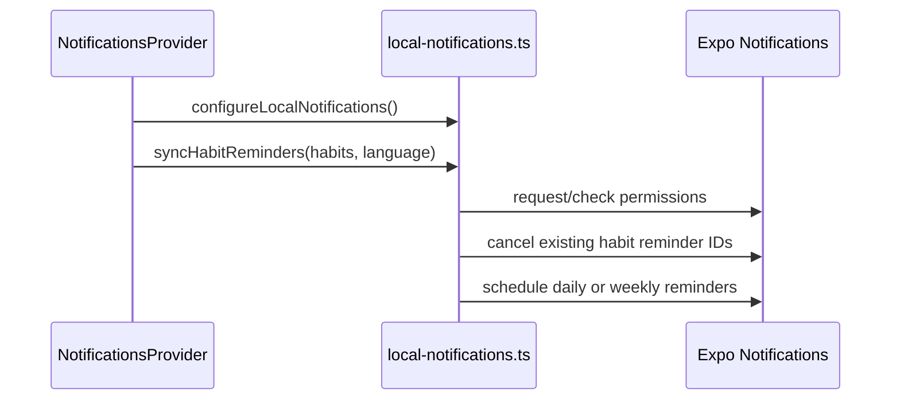
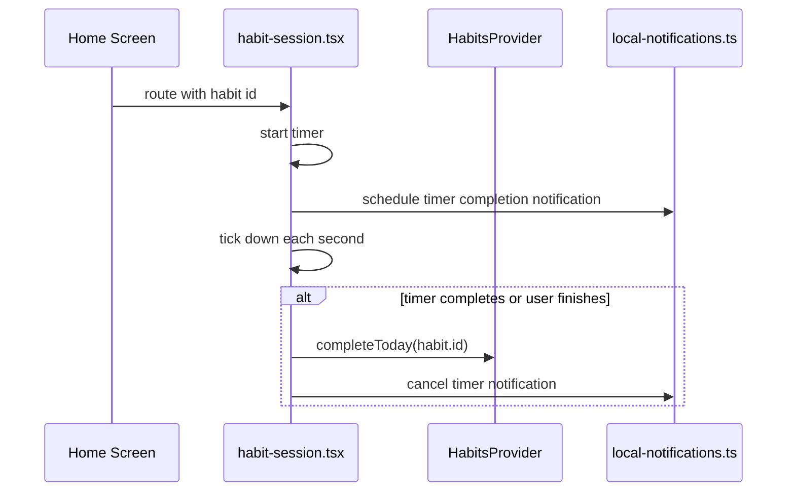

# System Design

## System Boundaries

The current system boundary is the mobile app plus static backend templates. There is no running backend in this repository. All interactive behavior is handled in React Native screens, providers, and local native services.

Evidence: `app/_layout.tsx:L55-L89`, `backend/templates/README.md:L1-L13`, `providers/auth-provider.tsx:L106-L120`.

## Key Flow: App Startup And Auth Gate

Evidence: `package.json:L2-L4`, `app/_layout.tsx:L31-L41`, `providers/auth-provider.tsx:L59-L94`.

## Key Flow: Create Habit

Evidence: `app/new-habit.tsx:L340-L450`, `app/new-habit.tsx:L452-L804`, `providers/habits-provider.tsx:L133-L150`.

## Key Flow: Local Reminder Sync

Evidence: `providers/notifications-provider.tsx:L23-L83`, `services/local-notifications.ts:L138-L317`.

## Key Flow: Focus Session Timer

Evidence: `app/(tabs)/index.tsx:L216-L219`, `app/habit-session.tsx:L27-L49`, `app/habit-session.tsx:L57-L183`, `services/local-notifications.ts:L319-L372`.

## Major Subsystems

### Frontend

Purpose: render all screens, handle interaction, apply theme/language, and call provider APIs.

Public interface: Expo Router route files in `app/`.

Error handling: screen-level fallbacks for missing habit, unavailable native modules, and permission failures.

Evidence: `app/habit-session.tsx:L185-L215`, `app/permissions.tsx:L81-L160`.

### Backend

Purpose: not implemented at runtime. Only static HTML templates exist for future flows such as login, signup, reset password, welcome, reminders, timer completion, and weekly review.

Public interface: none in this repo.

Evidence: `backend/templates/README.md:L1-L13`.

### Data

Purpose: persist demo user, habits, theme, and language locally.

Public interface: React context hooks.

Evidence: `providers/auth-provider.tsx:L131-L152`, `providers/habits-provider.tsx:L210-L225`, `providers/theme-provider.tsx:L125-L146`, `providers/language-provider.tsx:L625-L633`.

### Auth

Purpose: local demo auth gate and profile identity.

Public interface: `useAuth()` with `signIn`, `signUp`, `signOut`, and `updateProfile`.

Evidence: `providers/auth-provider.tsx:L12-L19`, `providers/auth-provider.tsx:L106-L129`.

### Notifications

Purpose: local habit reminders and focus timer completion notifications.

Public interface: exported functions from `services/local-notifications.ts`.

Evidence: `services/local-notifications.ts:L138-L403`.
