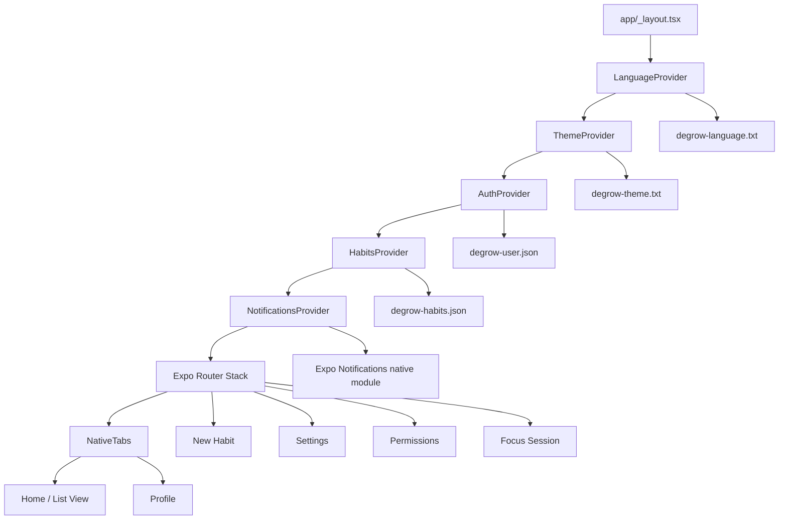

# Repository Map

## High-Level Tree

```text
.
|-- app/                         Expo Router routes and screens
|   |-- (auth)/                   Login and registration route group
|   |-- (tabs)/                   Native tab routes: home/list and profile
|   |-- _layout.tsx               Root provider and stack layout
|   |-- habit-session.tsx         Focus session timer screen
|   |-- new-habit.tsx             New habit creation screen
|   |-- permissions.tsx           Permissions screen
|   |-- settings.tsx              Settings screen
|-- assets/                      App icons, splash, and image assets
|-- backend/templates/           Static English HTML templates for future backend emails/pages
|-- components/                  Shared UI helper components
|-- constants/                   Habit seed data and theme helpers
|-- providers/                   Auth, habits, language, notifications, and theme providers
|-- services/                    Local notification service
|-- scripts/                     Expo starter reset script
|-- docs/                        Project documentation
|-- app.json                     Expo app/native configuration
|-- package.json                 npm scripts and dependency manifest
|-- tsconfig.json                TypeScript configuration
|-- eslint.config.js             ESLint configuration
```

Evidence: repository file inventory captured at baseline; `app.json:L2-L69`, `package.json:L2-L48`.

## Key Files And Purpose

- `app/_layout.tsx`: root layout, provider nesting, stack route registration, auth redirect behavior, and navigation theme.
  Evidence: `app/_layout.tsx:L31-L89`.
- `app/(tabs)/_layout.tsx`: native bottom tabs with Liquid Glass/blur appearance and the `index` and `profile` triggers.
  Evidence: `app/(tabs)/_layout.tsx:L14-L82`.
- `app/(tabs)/index.tsx`: home/list view, habit cards, completion toggles, summary metrics, and focus-session navigation.
  Evidence: `app/(tabs)/index.tsx:L166-L280`.
- `app/(tabs)/profile.tsx`: profile photo workflow, profile summary, stats, and photo bottom sheet.
  Evidence: `app/(tabs)/profile.tsx:L39-L77`, `app/(tabs)/profile.tsx:L225-L380`.
- `app/new-habit.tsx`: new habit form, preview card, icon picker, color picker, repeat pattern, session length, reminder bottom sheet, and create action.
  Evidence: `app/new-habit.tsx:L340-L450`, `app/new-habit.tsx:L452-L804`.
- `app/habit-session.tsx`: habit timer, pause/resume/reset/finish behavior, scheduled completion notification, and completion flow.
  Evidence: `app/habit-session.tsx:L18-L25`, `app/habit-session.tsx:L57-L183`, `app/habit-session.tsx:L232-L380`.
- `app/settings.tsx`: settings page, theme/language controls, notification toggles, and permissions entry.
  Evidence: `app/settings.tsx:L130-L293`.
- `app/permissions.tsx`: notification and media permission status/read/request/open-settings workflow.
  Evidence: `app/permissions.tsx:L81-L210`, `app/permissions.tsx:L253-L343`.
- `providers/auth-provider.tsx`: local demo auth, profile updates, sign-out, and persisted user state.
  Evidence: `providers/auth-provider.tsx:L5-L19`, `providers/auth-provider.tsx:L23-L51`, `providers/auth-provider.tsx:L106-L129`.
- `providers/habits-provider.tsx`: local habit persistence, week reset, create habit, toggle day, and complete today.
  Evidence: `providers/habits-provider.tsx:L17-L34`, `providers/habits-provider.tsx:L47-L66`, `providers/habits-provider.tsx:L133-L208`.
- `providers/language-provider.tsx`: English/Spanish translation table and persisted language preference.
  Evidence: `providers/language-provider.tsx:L4-L16`, `providers/language-provider.tsx:L18-L525`, `providers/language-provider.tsx:L565-L633`.
- `providers/theme-provider.tsx`: light/dark palette definitions and persisted/system theme resolution.
  Evidence: `providers/theme-provider.tsx:L5-L68`, `providers/theme-provider.tsx:L72-L146`.
- `providers/notifications-provider.tsx`: app-level notification setup, listener handling, reminder synchronization, and timer notification routing.
  Evidence: `providers/notifications-provider.tsx:L23-L83`.
- `services/local-notifications.ts`: guarded Expo Notifications integration, permission requests, reminder scheduling, timer notifications, and listener cleanup.
  Evidence: `services/local-notifications.ts:L22-L44`, `services/local-notifications.ts:L90-L136`, `services/local-notifications.ts:L181-L403`.
- `constants/habits.ts`: habit domain types, week-day helpers, seed habits, and default themes/reminders.
  Evidence: `constants/habits.ts:L3-L41`, `constants/habits.ts:L53-L107`, `constants/habits.ts:L109-L200`.
- `backend/templates/`: HTML templates only, no runtime backend.
  Evidence: `backend/templates/README.md:L1-L13`.

## Runtime Entrypoints

- JavaScript entrypoint: `expo-router/entry`.
  Evidence: `package.json:L2-L4`.
- Root Expo Router layout: `app/_layout.tsx`.
  Evidence: `app/_layout.tsx:L55-L89`.
- Auth route group: `app/(auth)/_layout.tsx`, `app/(auth)/login.tsx`, `app/(auth)/register.tsx`.
  Evidence: `app/(auth)/login.tsx:L22-L125`, `app/(auth)/register.tsx:L22-L139`.
- Main tab route group: `app/(tabs)/_layout.tsx`, `app/(tabs)/index.tsx`, `app/(tabs)/profile.tsx`.
  Evidence: `app/(tabs)/_layout.tsx:L48-L82`.
- Modal/detail routes: `app/new-habit.tsx`, `app/settings.tsx`, `app/permissions.tsx`, `app/habit-session.tsx`.
  Evidence: `app/_layout.tsx:L55-L67`.

## If You Only Read 10 Files

1. `README.md`
2. `docs/INDEX.md`
3. `docs/ARCHITECTURE.md`
4. `docs/design/UI_UX_RULES.md`
5. `app/_layout.tsx`
6. `app/(tabs)/index.tsx`
7. `app/new-habit.tsx`
8. `app/habit-session.tsx`
9. `providers/habits-provider.tsx`
10. `services/local-notifications.ts`

## Service And Module Map



Evidence: `app/_layout.tsx:L71-L89`, `providers/habits-provider.tsx:L41-L43`, `providers/auth-provider.tsx:L23-L51`, `providers/theme-provider.tsx:L66-L68`, `providers/language-provider.tsx:L14-L16`, `providers/notifications-provider.tsx:L23-L83`.

## CI/CD, Scripts, And Deployment Definitions

- npm scripts exist for Expo start, Android, iOS, web, lint, and reset-project.
  Evidence: `package.json:L5-L12`.
- No `.github/` workflows were present during the baseline inventory.
  Evidence: repository inventory command found no `.github/` files.
- Expo app metadata, icons, native plugins, and experimental options are configured in `app.json`.
  Evidence: `app.json:L2-L69`.
- `scripts/reset-project.js` is an Expo starter reset script that can move/delete application folders. Treat it as destructive unless intentionally resetting the project.
  Evidence: `scripts/reset-project.js:L1-L112`.
